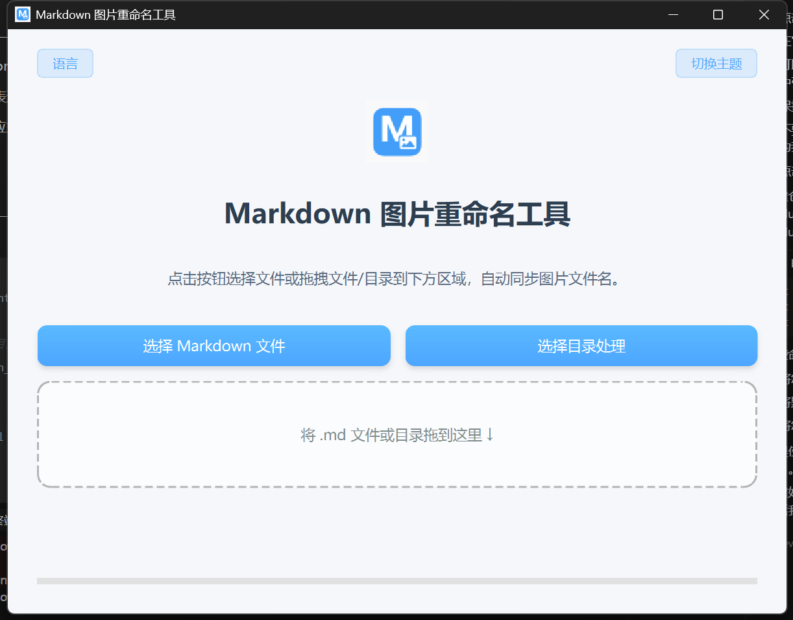

# Markdown图片重命名工具

一个简单实用的工具，用于自动重命名Markdown文档中引用的图片文件。工具源于使用md时,想将图片的描述改为图片的名字.所以整了个工具

## 功能特点

- 支持单个Markdown文件或整个目录的批量处理
- 自动同步更新Markdown文件中的图片引用路径
- 支持拖放操作，方便快捷
- 提供进度显示和结果反馈
- 支持中英文语言切换
- 支持浅色/深色主题切换

## 使用方法

1. 点击"选择Markdown文件"按钮选择单个.md文件
2. 点击"选择目录处理"按钮选择包含多个.md文件的文件夹
3. 或直接将.md文件/文件夹拖放到应用程序窗口

程序会自动处理并重命名相关图片文件，保持引用路径的一致性。

## 安装方法

### 方法一：直接使用可执行文件（推荐）

1. 从[Releases](https://github.com/yourusername/markdown_rename_tool/releases)页面下载最新版本的可执行文件
2. 解压后双击 `markdown_rename_tool.exe` 即可使用
3. 可以创建快捷方式到桌面，方便日常使用

### 方法二：从源码运行

如果你想从源码运行或进行开发，请按照以下步骤操作：

```bash
# 克隆仓库
git clone https://github.com/yourusername/markdown_rename_tool.git

# 进入项目目录
cd markdown_rename_tool

# 安装依赖
pip install -r requirements.txt

# 运行程序
python main.py
```

## 打包成可执行文件

如需将源码打包成可执行文件：

```bash
# 安装PyInstaller
pip install pyinstaller

# 执行打包脚本
python build.py
```

打包完成后，可执行文件将位于 `dist` 文件夹中。

## 技术实现

- 使用Python和PyQt6构建跨平台GUI应用
- 使用正则表达式识别并处理Markdown中的图片引用
- 实现了响应式界面设计和主题切换功能

## 截图


